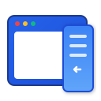

# Tab in Side 🚀

[](https://addons.mozilla.org/)
[](https://opensource.org/licenses/MIT)

**Tab in Side** is a powerful Firefox extension designed to make multitasking seamless. It allows you to open any website, link, or bookmark directly within your browser's sidebar, complete with a mobile-spoofed interface for better fit and accessibility.

<p align="center">
  
  <br>
  <span style="font-size: 32px; font-weight: 800; background: linear-gradient(135deg, #2563eb, #3b82f6, #60a5fa); -webkit-background-clip: text; -webkit-text-fill-color: transparent; font-family: -apple-system, BlinkMacSystemFont, 'Segoe UI', Roboto, sans-serif;">Tab in Side</span>
</p>

## 🖼️ Visual Showcase

| Feature | Screenshot |
| :--- | :--- |
| **Seamless Sidebar Integration**: Enhance your productivity with side-by-side browsing. Open any webpage or perform quick searches directly within the sidebar. This allows you to cross-reference data, look up definitions, or watch tutorials while staying focused on your primary workspace. |  |
| **Instant Context Menu Access**: Transform your right-click into a powerful navigation tool. Simply right-click anywhere on a webpage or on a specific link to instantly beam that content to the sidebar. It eliminates the hassle of tab-switching and keeps your workflow fluid and uninterrupted. |  |
| **Direct Bookmark Launch**: Your favorites are now just a click away. We’ve integrated Tab-in-Side directly into your Firefox Bookmarks. Right-click any saved bookmark to open it immediately in the side panel, making your most-used resources available without cluttering your tab bar. |  |
| **Quick Access & History Management**: Personalize your dashboard for maximum efficiency. Use the settings page to configure up to 10 high-priority quick-access links. You can also manage your browsing trail by adjusting separate limits for toolbar shortcuts and persistent background history (up to 100 entries). |  |
| **Transparent & Open Source**: Built with trust and community in mind. Tab-in-Side is fully open-source. You can explore, audit, or contribute to the entire codebase on GitHub. We believe in transparency and welcome developers to help us make the extension even better. |  |

## ✨ Core Capabilities

- **Seamless Context Menu Integration**: Effortlessly open any hyperlink, current webpage, or saved bookmark directly into your browser's sidebar with a single right-click. No more switching tabs for quick lookups.
- **Customizable Quick Access**: Features a dynamic toolbar where you can pin up to 10 of your most-visited websites for instant, one-click navigation.
- **Smart & Scalable History Tracking**: Keeps a running list of your recently viewed sidebar pages (up to 100), with a convenient dropdown menu for full access and configurable toolbar button limits.
- **Integrated Extension Suite**: Access the comprehensive settings dashboard directly from the sidebar to manage your homepage, quick access pins, and dual history limits (Toolbar vs. Storage) on the fly.

## 🛠 Installation

### For Developers (Temporary)
1. Clone this repository: `git clone https://github.com/PhuongPN6689/tab-in-side.git`
2. Open Firefox and navigate to `about:debugging#/runtime/this-firefox`.
3. Click **Load Temporary Add-on...**.
4. Select the `manifest.json` file from the project folder.

### Build to zip

```bash
npx web-ext build --config web-ext-config.cjs
```

### For Users (Once Published)
Install directly from the [Firefox Add-on Store](https://addons.mozilla.org/vi/firefox/addon/tab-in-side/).

## 📖 Usage Guide

1. **Open the Sidebar**: Trigger the sidebar manually or right-click any link -> *"Open in Tab in Side"*.
2. **Browse in Mobile Mode**: Toggle "Mobile View" in the settings to force mobile layouts.
3. **Quick Switch**: Use the icons in the toolbar to jump between pinned sites or click the **dropdown arrow** to access your full history records.
4. **Customize**: Click the gear icon (⚙️) to set your homepage, pins, and dual history limits.

## 🤝 Contributing

Contributions are welcome! Whether you're fixing a bug, adding a new feature, or improving documentation, your help is appreciated.

- **For Users**: Feel free to open [issues](https://github.com/PhuongPN6689/tab-in-side/issues).
- **For Developers**: Check out our [Getting Started Guide (CONTRIBUTING.md)](CONTRIBUTING.md) for a deep dive into the architecture and setup.


## 📄 License

This project is licensed under the MIT License - see the [LICENSE](LICENSE) file for details.

---
Developed with ❤️ by Nguyen Phuong.
