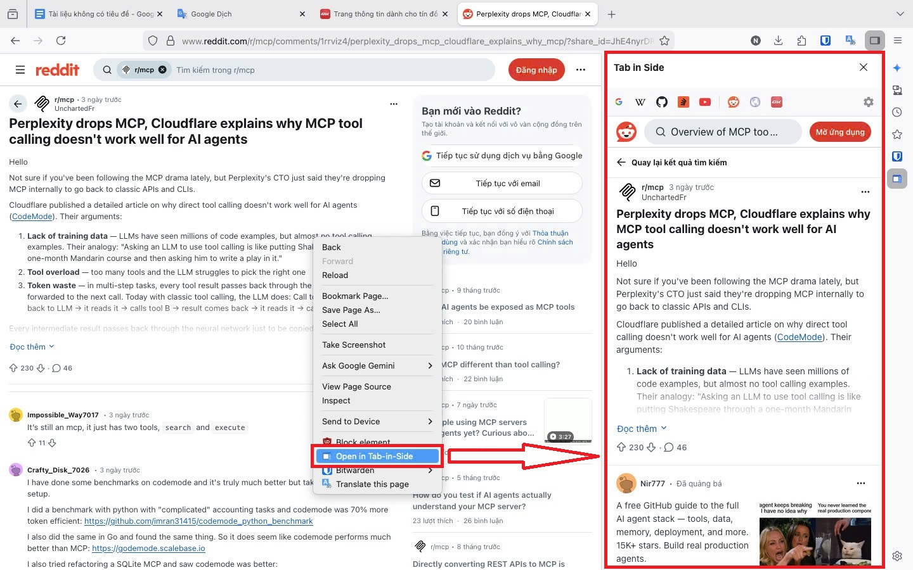
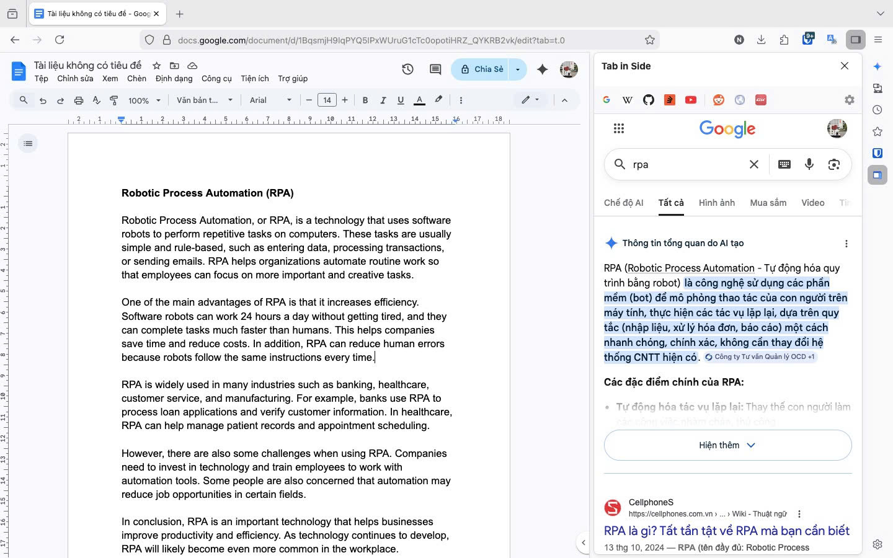
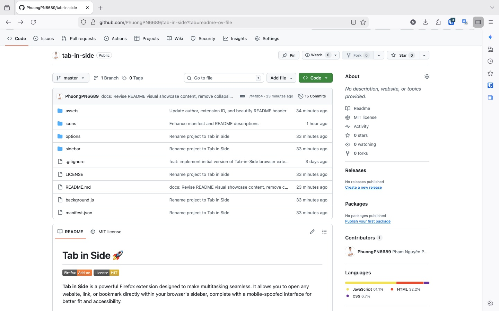
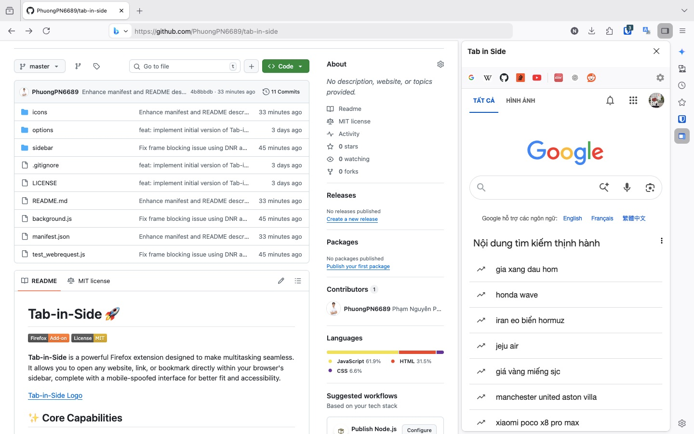
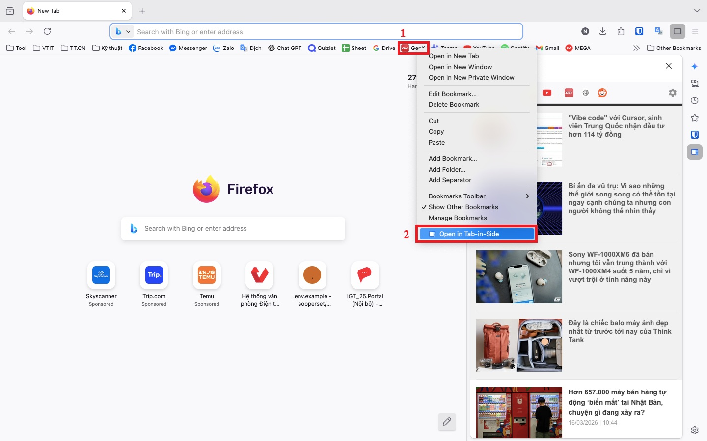

# Tab in Side 🚀

**Tab in Side** is a powerful Firefox extension designed to make multitasking seamless. It allows you to open any website, link, or bookmark directly within your browser's sidebar, complete with a mobile-spoofed interface for better fit and accessibility.

  
   
  Tab in Side

## 🖼️ Visual Showcase

<b>Click to expand screenshots gallery</b>

 

| Feature | Screenshot |
| :--- | :--- |
| **Seamless Integration** |  |
| **Mobile View in Action** |  |
| **Quick Access & History** |  |
| **GitHub Compatibility** |  |
| **Bookmark Context Menu** |  |

## ✨ Core Capabilities

- **Seamless Context Menu Integration**: Effortlessly open any hyperlink, current webpage, or saved bookmark directly into your browser's sidebar with a single right-click. No more switching tabs for quick lookups.
- **Advanced Header Bypassing (DNR)**: Powered by `declarativeNetRequest`, Tab in Side strips restrictive security headers like `X-Frame-Options`, `Frame-Options`, and `Content-Security-Policy`. This enables the embedding of previously "unframeable" sites such as **m.genk.vn**, **YouTube**, **Facebook**, and **GitHub**.
- **Intelligent Mobile Spoofing**: Automatically simulates a mobile device environment (iPhone User-Agent) within the sidebar. This forces websites to render their specialized mobile layouts, providing a perfectly optimized and readable experience in the narrow sidebar space.
- **Customizable Quick Access**: Features a dynamic toolbar where you can pin up to 5 of your most-visited websites for instant, one-click navigation.
- **Smart History Tracking**: Keeps a running list of your recently viewed sidebar pages, allowing you to jump back to previous content without re-entering URLs.
- **Integrated Extension Suite**: Access the comprehensive settings dashboard directly from the sidebar to manage your homepage, quick access pins, and history limits on the fly.

## 🛠 Installation

### For Developers (Temporary)
1. Clone this repository: `git clone https://github.com/PhuongPN6689/tab-in-side.git`
2. Open Firefox and navigate to `about:debugging#/runtime/this-firefox`.
3. Click **Load Temporary Add-on...**.
4. Select the `manifest.json` file from the project folder.

### For Users (Once Published)
Install directly from the [Firefox Add-on Store](https://addons.mozilla.org/).

## 📖 Usage Guide

1. **Open the Sidebar**: Trigger the sidebar manually or right-click any link -> *"Open in Tab in Side"*.
2. **Browse in Mobile Mode**: Toggle "Mobile View" in the settings to force mobile layouts.
3. **Quick Switch**: Use the icons in the top-left toolbar to jump between your pinned sites or recent history.
4. **Customize**: Click the gear icon (⚙️) to set your homepage, pins, and history limit.

## 🤝 Contributing

Contributions are welcome! Feel free to open issues or submit pull requests.

## 📄 License

This project is licensed under the MIT License - see the [LICENSE](LICENSE) file for details.

---
Developed with ❤️ by Nguyen Phuong.
