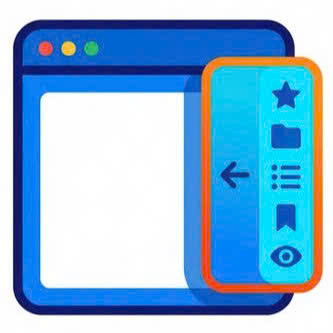

# Tab-in-Side 🚀

**Tab-in-Side** is a powerful Firefox extension designed to make multitasking seamless. It allows you to open any website, link, or bookmark directly within your browser's sidebar, complete with a mobile-spoofed interface for better fit and accessibility.

## ✨ Key Features

- **Context Menu Integration**: Right-click any link, page, or bookmark and select *"Open in Tab-in-Side"*.
- **Mobile View Mode**: Automatically spoofs an iPhone User-Agent for websites in the sidebar, ensuring they look great even in a narrow space.
- **Header Bypass**: Strips `X-Frame-Options` and modifies `Content-Security-Policy` so you can embed tricky sites like YouTube, Facebook, and GitHub.
- **Dynamic Quick Access**: Add up to 5 of your favorite sites to the sidebar toolbar.
- **Recent History**: Keep track of your last $n$ visited sidebar pages for quick switching.
- **Direct Settings**: Access the configuration page directly from the sidebar.

## 🛠 Installation

### For Developers (Temporary)
1. Clone this repository: `git clone https://github.com/your-username/tab-in-side.git`
2. Open Firefox and navigate to `about:debugging#/runtime/this-firefox`.
3. Click **Load Temporary Add-on...**.
4. Select the `manifest.json` file from the project folder.

### For Users (Once Published)
Install directly from the [Firefox Add-on Store](https://addons.mozilla.org/).

## 📖 Usage Guide

1. **Open the Sidebar**: Trigger the sidebar manually or right-click any link -> *"Open in Tab-in-Side"*.
2. **Browse in Mobile Mode**: Toggle "Mobile View" in the settings to force mobile layouts.
3. **Quick Switch**: Use the icons in the top-left toolbar to jump between your pinned sites or recent history.
4. **Customize**: Click the gear icon (⚙️) to set your homepage, pins, and history limit.

## 🤝 Contributing

Contributions are welcome! Feel free to open issues or submit pull requests.

## 📄 License

This project is licensed under the MIT License - see the [LICENSE](LICENSE) file for details.

---
Developed with ❤️ by Antigravity UI.
